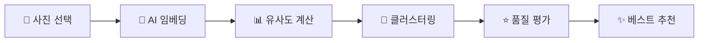

# oneShot 📸

AI 기반 여행 사진 자동 큐레이션 앱 - 중복 사진을 클러스터링하고 베스트 샷을 추천합니다.

## ✨ 주요 기능

- 🤖 **온디바이스 AI**: DINOv2 모델로 사진 임베딩 추출
- 📱 **실시간 처리**: TensorFlow Lite 기반 빠른 분석
- 🎯 **스마트 클러스터링**: 유사한 사진 자동 그룹화
- ⭐ **베스트 샷 선별**: 품질 지표 기반 추천 시스템
- 🔄 **로버스트 로딩**: 다중 모델 호환성 지원

## 🚀 빠른 시작

```bash
# 의존성 설치
flutter pub get

# 앱 실행
flutter run

# 릴리스 빌드 (선택사항)
flutter build apk --release
```

## 🏗️ 최신 업데이트 (2025-08)

✅ **TFLite 모델 호환성 문제 해결**
- `FULLY_CONNECTED` version 12 오류 수정
- 다중 모델 로딩 시스템 구현 (`dinov2_vits14_embed.tflite` 우선)
- MockTFLite 폴백 제거로 실제 AI 모델만 사용

✅ **안정적인 모델 초기화**  
- 호환 모델 순차 시도: `dinov2_vits14_embed.tflite` → `dinov2_vits14_embed_dynamic.tflite` → `similarity_model_dynamic.tflite`
- 동적 입력 텐서 리사이징 지원
- 여러 인터프리터 옵션 자동 시도 (기본/NNAPI)

## 📁 프로젝트 구조

```
lib/
├── 🏠 main.dart                     # 앱 진입점 & 탭 네비게이션
├── 🔄 providers/                    # 상태 관리
│   └── photo_processing_provider.dart
├── 🧠 engine/                       # AI 엔진 코어
│   ├── embedding_runner.dart        # 임베딩 추출 인터페이스
│   ├── tflite_embedding_runner.dart # TFLite 실행기
│   ├── grouping.dart               # 클러스터링 알고리즘
│   └── ranking.dart                # 품질 기반 순위 매기기
├── ⚙️  services/                    # 백엔드 서비스
│   ├── tflite_service.dart         # TFLite 모델 로딩/추론
│   └── asset_photo_service.dart    # 이미지 로딩
├── 📱 screens/                      # 화면 UI
│   ├── home_screen.dart            # 홈 (진행상황/통계)
│   ├── clusters_screen.dart        # 클러스터 목록
│   └── recommended_screen.dart     # 추천 사진
└── 🎨 widgets/                      # 공통 위젯
    ├── stats_card.dart             # 통계 카드
    └── cluster_view.dart           # 클러스터 뷰
```

## 🎯 AI 모델 & 데이터

**TFLite 모델 (우선순위 순)**
- `dinov2_vits14_embed.tflite` ← 메인 모델 ✅
- `dinov2_vits14_embed_dynamic.tflite` ← 동적 입력 지원
- `similarity_model_dynamic.tflite` ← 실험용

**샘플 데이터**  
- `data/` 폴더에 테스트용 이미지 배치
- 실제 사용자 사진은 `.gitignore`로 제외

## ⚙️ 동작 원리



1. **사진 로딩**: `data/` 폴더에서 이미지 자동 탐지
2. **AI 분석**: DINOv2 모델로 384차원 임베딩 추출  
3. **클러스터링**: 코사인 유사도 기반 그룹화
4. **품질 평가**: 샤프니스, 노출 등 지표로 점수 계산
5. **추천 생성**: 각 그룹에서 최고 품질 사진 선별

## 🔧 개발 환경 설정

**요구사항**
- Flutter SDK 3.10.0+
- Dart 3.0.0+
- Android Studio / VS Code
- Android 에뮬레이터 또는 실제 기기

**ProGuard 설정** (릴리스 빌드 시)
```gradle
# android/app/proguard-rules.pro
-keep class org.tensorflow.lite.** { *; }
-keep class io.flutter.** { *; }
-keep class com.google.flatbuffers.** { *; }
```

## 🚨 문제 해결

**TFLite 모델 로딩 실패**
```bash
flutter clean && flutter pub get && flutter run
```
- 다중 모델 자동 시도로 호환성 보장
- `dinov2_vits14_embed.tflite`가 우선 로딩됨

**성능 최적화**
- NNAPI 가속 자동 시도 (Android)
- 동적 텐서 리사이징 지원
- 4D NHWC 입력 형식 자동 보장

## 🔮 로드맵

- [ ] **GPU 가속**: GPU Delegate 지원
- [ ] **실제 갤러리**: `photo_manager`로 기기 사진 접근  
- [ ] **고급 얼굴 인식**: 실제 얼굴 품질 모델 연동
- [ ] **성능 벤치마크**: 자동 최적화 설정
- [ ] **APK 최적화**: 모델 분리 & 압축

## 📚 참고 자료

- [Flutter 공식 문서](https://flutter.dev/docs)
- [TensorFlow Lite](https://www.tensorflow.org/lite)
- [DINOv2 논문](https://arxiv.org/abs/2304.07193)

---

Made with ❤️ using Flutter & AI
